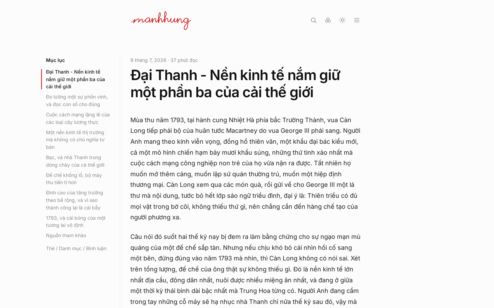
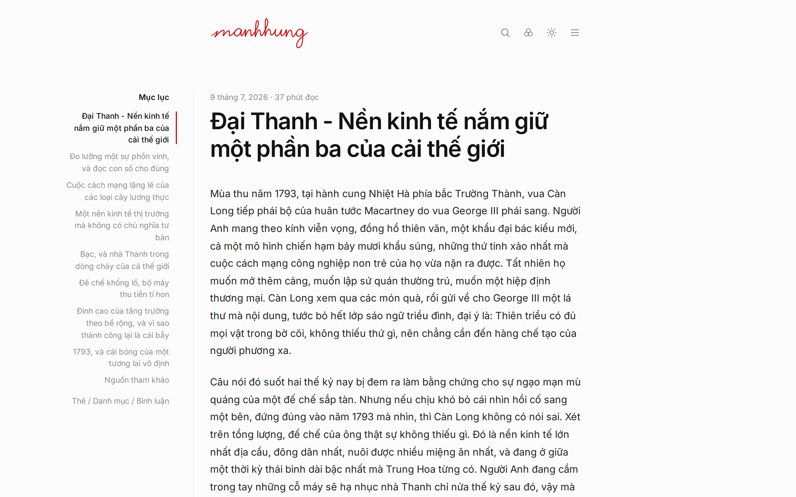
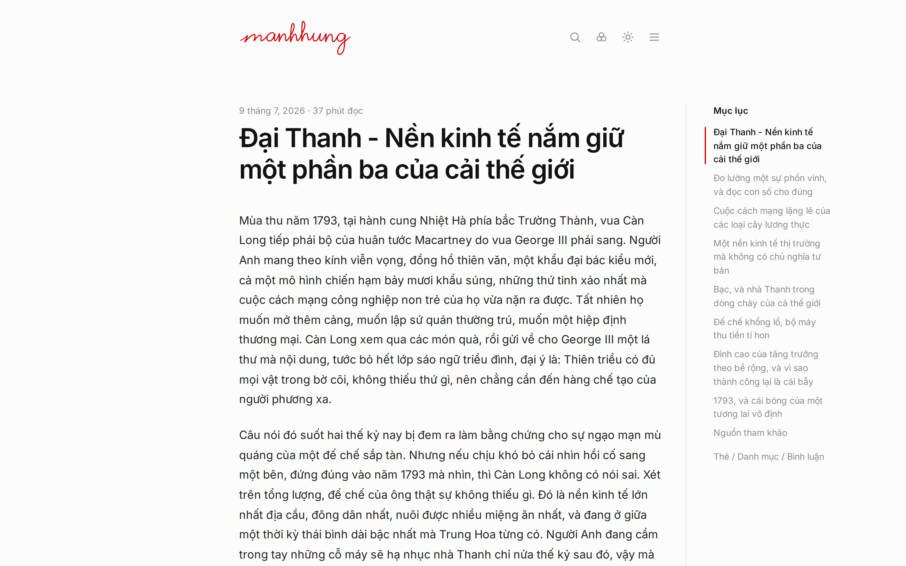

# Sidebar variants (rendered on the live site, not a mockup)

## A. Current: rail left, no divider

## B. Rail left, hairline divider, text left-aligned

## C. Rail left, hairline divider, text right-aligned
Wrapped items rag on the left ("bản", "vô định" land alone), and the accent
marker ends up 14px from the divider — two vertical lines competing.

## D. Rail moved to the RIGHT gutter, hairline on its left
The article leads the eye, the index is secondary. This is the docs-site
convention (Stripe, MDN). Text stays left-aligned.

