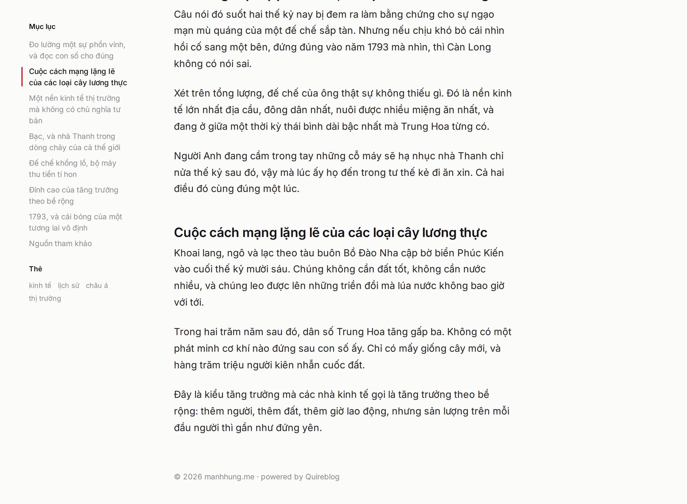

# Facelift preview (not implemented)

Static mockup only. No Quire source is touched on this branch.

The reading column stays **centred on the page**, exactly as today. The rail is
absolutely placed in the left gutter and never displaces it, and it sticks as
you scroll. It carries no border, no shadow and no background: it is typography
sitting on the page, not a panel. On a post it holds the table of contents; on
the home page it holds the tagline, the categories and the tags.

Other changes: a display-size lead post, a category label on every entry, a
full-width divider replacing the 50% stub, a deck line under post titles, and
the logo red `#d80000` echoed as the single accent (the marker beside the active
rail row, and the title hover underline).

The signature logo is kept as-is.

## Desktop, 1280px

Home

Post

Post, scrolled 1000px. The rail stays with you, the active section is marked.

## Mobile, 390px

Below 1280px the gutter cannot hold the rail, so it unstacks to the top:
tagline plus a horizontal category scroller.

Home

Post

## Source

`mockup/` is self-contained. Open `mockup/home.html` in a browser to hover the
accent and resize the window. Fonts and logo are copied from production.

This is an orphan branch: it carries only the preview, no Quire source. Delete
it once the direction is settled.
