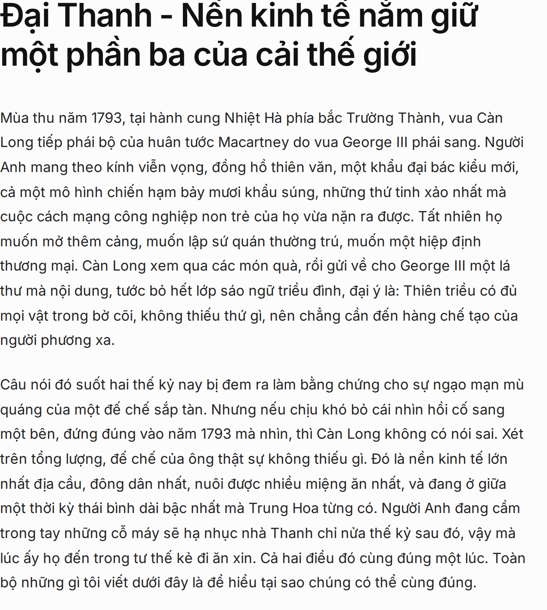
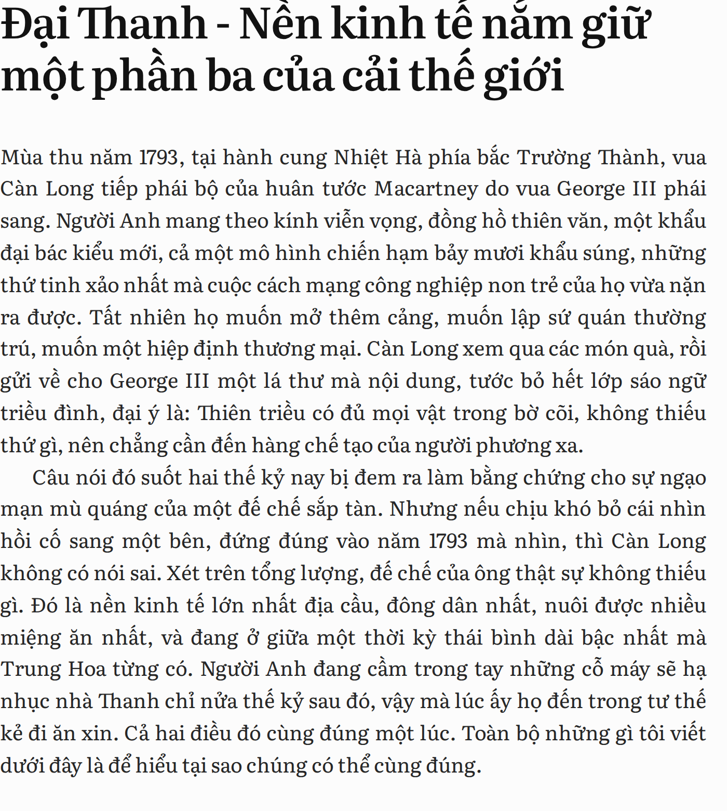

# Book-page typography: a preview on the real article

Same paragraphs, same 680px column, same screen. Only the setting changes.

## A. Today — Inter, ragged right, blank line between paragraphs

## B. Book mode — Literata, justified, first-line indent, oldstyle figures
Body 19.5px / 1.58, `text-align: justify`, `text-indent: 1.6em` (flush after a
heading), `font-feature-settings: "onum"` so 1793 sits in the line instead of
standing above it.

## Why justification is safe in Vietnamese

Measured over the 6,270 words of this article: the average token is **3.37
characters** and only **0.3%** of words run longer than 7. Short tokens mean the
justifier only has to nudge word spaces, so no rivers open up. English, with its
long words, needs hyphenation to justify cleanly. Vietnamese does not.
