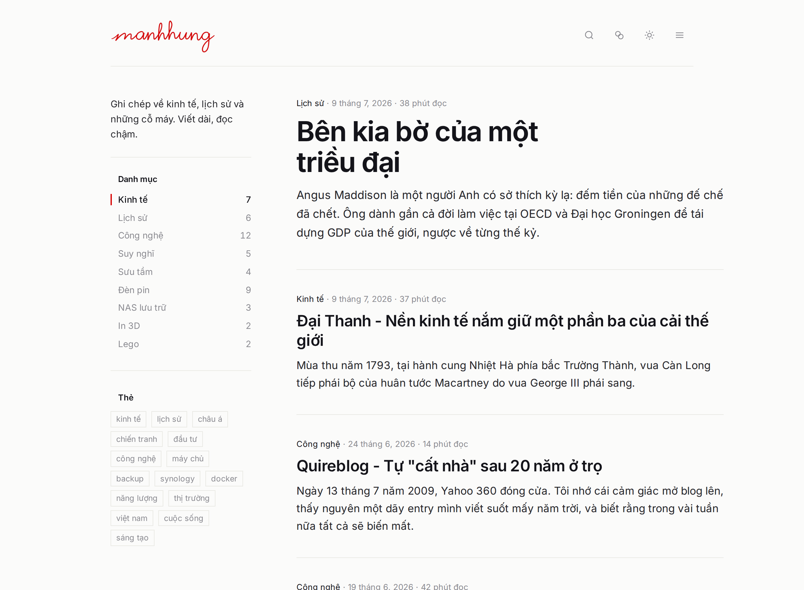
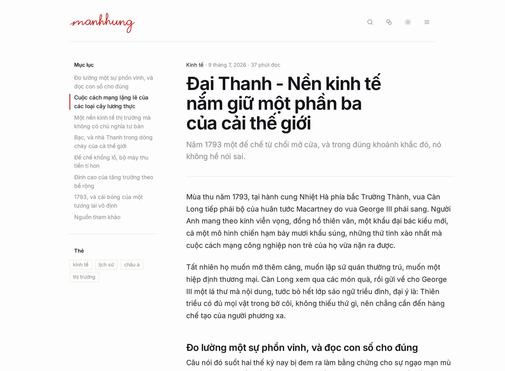
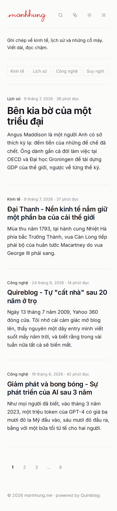
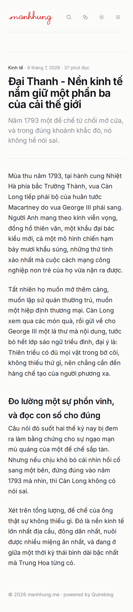

# Facelift preview (not implemented)

Static mockup only. No Quire source is touched on this branch.

Core idea: replace the single 680px strip with a real two-column grid, a 224px
sticky rail plus the 680px reading column. The rail holds the site identity,
categories and tags on the home page, and the table of contents on a post. The
TOC stops floating (`fixed left-0`) and becomes part of the grid.

Other changes: a display-size lead post, a category label on every entry, a
full-width divider replacing the 50% stub, a deck line under post titles, and
the logo red `#d80000` echoed as the single accent (active rail item, title
hover underline).

The signature logo is kept as-is.

## Desktop, 1280px

Home

Post

## Mobile, 390px

The rail unstacks to the top: tagline plus a horizontal category scroller.

Home

Post

## Source

`mockup/` is self-contained. Open `mockup/home.html` in a browser to hover the
accent and resize the window. Fonts and logo are copied from production.

This is an orphan branch: it carries only the preview, no Quire source. Delete
it once the direction is settled.
