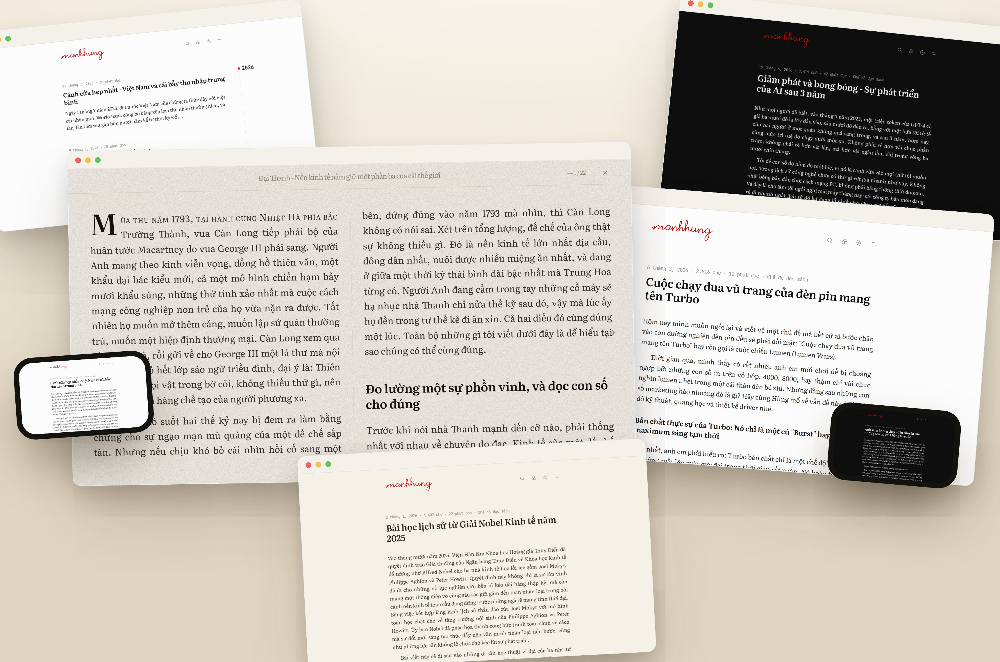

<div align="center">

# **quire**blog &nbsp;`v1.4.8`

**An AI-operated personal blog platform. Self-hosted, no cloud lock-in.**
Write and publish from a clean multilingual admin — or hand the keys to an AI agent and let it write, publish, and even deploy for you.

<br/>


[**🌐 Live demo**](https://manhhung.me) · [**Get your own copy**](#-get-your-own-copy) · [**Let an AI run it**](#-let-an-ai-agent-write--publish-mcp) · [**Architecture**](./ARCHITECTURE.md) · [**Roadmap**](./ROADMAP.md) · [**License**](#-license)

<sub>The demo at **manhhung.me** is the author's personal blog — a live instance to see the *platform* in action, not a content showcase (ignore what it says, look at how it works).</sub>

<br/>



</div>

---

## ✨ What it is

An **open-source** (MIT), single-owner blog built for people who just want to **write** — and to **own the whole stack**. No SaaS, no vendor lock-in: text lives in your own **PostgreSQL**, binaries on your own **disk**, running on **your server**. The public site is statically cached so it loads **insanely fast on mobile and desktop**, and it's tuned around **readable typography** — a clean reading experience first. Everything is **easy to tweak from the admin** (palettes, type, menu, fonts) with **no hardcoded values** anywhere, so you make it yours without touching code.

All the writing happens in a polished `/admin` (or over MCP). Text lives in **PostgreSQL** (reached through **PostgREST** with the `supabase-js` client); images, files, and icons are plain files on the **local filesystem**. No git push to publish, no CMS to wrangle.

| Area | What you get |
|:---|:---|
| 🖋️&nbsp;**Editor** | TipTap 3 + Markdown · sticky one-row toolbar · optional typewriter caret + key feedback · drag-drop / paste image upload (JPG · PNG · WebP · AVIF · GIF · SVG) with responsive `sharp` variants (original + AVIF/WebP) · captioned figures (left/center/right, column / large / full-bleed / gallery grid) · tables · video embeds · 3-version time machine · offline local autosave · one-click draft preview |
| 🎨&nbsp;**Look** | a calm, editorial admin · 6 customizable light+dark palettes (+ an accent) · one tunable type system (per-role size/leading/tracking, no hardcoded sizes) · four built-in reading fonts (or upload a custom font per weight), scoped to reading text |
| 🌍&nbsp;**i18n** | Admin + site in `en · vi · de · ja · zh · ko` |
| 🔍&nbsp;**Reading** | instant local + Postgres full-text search · a left sidebar rail (categories + tags, or a post's ToC) · related posts · reading time · progress bar · full-bleed images on mobile |
| 📈&nbsp;**Built-in** | cookieless analytics (views / visitors / top pages, no PII) · activity log · soft-delete Trash (nothing auto-purges) · in-app Help / Guide |
| 🔎&nbsp;**SEO** | sitemap · RSS · `robots.txt` · `llms.txt` · dynamic OG images — all toggleable |
| 💾&nbsp;**Backups** | one-click full snapshots (DB + all binaries) to **Google Drive**, scheduled + restore |
| 📥&nbsp;**Import** | one-click **WordPress import** from the admin — upload your WXR export, posts + pages land as Markdown |
| 🤖&nbsp;**MCP** | a remote endpoint that lets an AI agent write & manage the blog with the same rules as the admin |
| 📱&nbsp;**PWA** | installable, launches standalone |
| 🔐&nbsp;**Auth** | NextAuth v5 · Google sign-in · single authorized owner · edge-guarded admin/API · rate-limited public endpoints |
| 🚀&nbsp;**Deploy** | **native** on your own Linux server, **or** **Docker** — bundled Postgres + local storage, **no cloud account** either way · `/api/health` probe · tracked DB migrations · fail-fast env validation |

> Built on **Next.js 16** (App Router, React 19, strict TS) + **Tailwind v4**, backed by **PostgreSQL + PostgREST**, binaries on the **local filesystem**.

**Who it's for** — one person who wants a fast, good-looking, **fully self-owned** blog on their own server (native or Docker), and likes the idea of letting an AI agent help run it.
**Not for** — multi-author teams / publications needing roles and editorial workflows. Quire Blog is single-owner by design (one authorized email); multi-tenant lives in the planned SaaS, not here.

---

## 🚀 Get your own copy

Two ways to stand up your own blog — **pick one**. Both run entirely on **your own server, no cloud account**.

<details open>
<summary><b>1️⃣ &nbsp;Docker</b> &nbsp;— the fastest path, one command</summary>

<br/>

**Fully self-contained.** The stack bundles **PostgreSQL + PostgREST** (your database) and stores binaries on the **local filesystem**, plus a cron sidecar. Everything runs on your host; only Google sign-in reaches the internet. Data lives in `./data/postgres` (text) + `./data/uploads` (binaries) — back up those two folders.

```bash
git clone https://github.com/joiha-steven/Quire.git && cd Quire
cp .env.docker.example .env.docker
node scripts/docker/gen-keys.mjs >> .env.docker   # DB password + JWT secret + service key
# then fill AUTH_SECRET, AUTH_GOOGLE_ID/SECRET, AUTHORIZED_EMAIL, SITE_URL, CRON_SECRET
docker compose up -d --build   # app on :3000 + db + rest + cron
```

Then point a reverse proxy / TLS at port `3000`, and register `<SITE_URL>/api/auth/callback/google` (and `<SITE_URL>/api/backup/callback` for Drive backups) on your Google OAuth client. The image needs **no backend env to build** — secrets are supplied at runtime; the bundled DB applies [`scripts/schema.sql`](./scripts/schema.sql) automatically on first boot.

</details>

<details>
<summary><b>2️⃣ &nbsp;Native</b> &nbsp;— install directly on a Linux server (e.g. behind CloudPanel / nginx)</summary>

<br/>

Run the same components **without Docker** — PostgreSQL, PostgREST, and the Next.js app as plain services on your host, behind any reverse proxy. Full step-by-step (systemd units, PostgREST config, nginx, migration from an existing instance) in **[`docs/self-host-native.md`](./docs/self-host-native.md)**. In short:

```bash
# 1. Database
apt install -y postgresql-16
sudo -u postgres createdb quire
sudo -u postgres psql -d quire -f docker/initdb/01_roles.sql   # anon + service_role + authenticator
sudo -u postgres psql -d quire -f scripts/schema.sql
sudo -u postgres psql -d quire -f docker/initdb/03_grants.sql

# 2. PostgREST (binary → systemd) on 127.0.0.1:3001, secrets from gen-keys.mjs
node scripts/docker/gen-keys.mjs   # -> PGPASSWORD, PGRST_JWT_SECRET, SUPABASE_SERVICE_ROLE_KEY

# 3. App
npm ci && npm run build
# fill .env.local (see docs/self-host-native.md), then run `next start` under systemd/supervisor
```

Point your reverse proxy at the app's port, register the Google OAuth redirect URIs, and add an hourly cron hitting `/api/cron` with `CRON_SECRET`.

</details>

<details>
<summary><b>🤖 &nbsp;Hand it to an AI agent</b> &nbsp;— Claude, OpenAI Codex, …</summary>

<br/>

Give an agent **SSH to your server** (and GitHub access), then ask it to deploy either flavor above: clone the repo, stand up PostgreSQL + PostgREST + the app (native or Docker), walk you through creating a Google OAuth "Web" client (it can't log into your Google account, so it guides you through the Cloud Console and collects the client ID/secret), set the env vars, and return the live URL. Everything else it does end to end.

</details>

> [!TIP]
> Large uploads have **no 4.5 MB cap** on a self-host — the browser posts straight to the server, so big photos just work. Put **Cloudflare (or any CDN)** in front for global edge caching + TLS.

---

## 🤖 Let an AI agent write & publish (MCP)

Quire Blog ships a remote **MCP** server, so a second AI agent can run your blog — drafting, editing, tagging, and **publishing straight to the live site**. No git, no deploy: content goes into Postgres + the local store through the same data layer (and same slug/revision/soft-delete rules) the admin uses.

1. **Turn it on** — *Admin → Settings → Advanced → MCP*, generate a named token (shown **once**, hashed at rest, expires in 180 days).
2. **Connect your agent** to the endpoint `https://<your-domain>/api/mcp` with `Authorization: Bearer <token>` (OAuth connectors are supported too).
3. **Prompt it**, e.g.:

```text
Using the Quire Blog MCP server, write a 600-word post titled
"What I learned shipping a blog with an AI agent", give it the tags
"ai" and "writing", set a friendly excerpt, and publish it.
```

The post is live in seconds. Sensitive settings are blocked over MCP, and you stay the sole authority — revoke any token from the admin and it's gone.

---

## 🔑 Environment variables

See [`.env.example`](./.env.example) (native) and [`.env.docker.example`](./.env.docker.example) (Docker). The essentials:

| Variable | Required | What it is · where to get it |
|---|:---:|---|
| `AUTH_SECRET` | ✅ | NextAuth secret — generate with `npx auth secret` |
| `AUTHORIZED_EMAIL` | ✅ | The only email allowed into `/admin` — your email |
| `AUTH_GOOGLE_ID` / `AUTH_GOOGLE_SECRET` | ✅ | Google OAuth "Web" client (admin sign-in + optional commenter login) — [Cloud Console → Credentials](https://console.cloud.google.com/apis/credentials) |
| `SITE_URL` / `AUTH_URL` | ✅ | Canonical public URL of your instance (OG/sitemap/auth callbacks) |
| `SUPABASE_URL` | ✅ | Your **PostgREST endpoint** (e.g. `http://127.0.0.1:3001`). Named `SUPABASE_` because the data layer uses the `supabase-js` client, which speaks PostgREST — **not** a Supabase cloud project |
| `POSTGREST_DIRECT` | ✅ | `1` when talking to a bare PostgREST (strips the `/rest/v1` path prefix supabase-js adds) |
| `SUPABASE_SERVICE_ROLE_KEY` | ✅ | HS256 JWT (`role=service_role`) signed with the PostgREST `jwt-secret` — generate both with `node scripts/docker/gen-keys.mjs` |
| `STORAGE_LOCAL_DIR` | ✅ | Directory that holds binaries (`media/`, `files/`), served at `/uploads` (Docker image defaults to `/app/uploads`) |
| `CRON_SECRET` | ◻️ | Protects `/api/cron` (keep-alive + variant sweep + scheduled backup) — any random string |
| `MCP_OAUTH_SECRET` | ◻️ | Signs MCP OAuth codes — random; falls back to `AUTH_SECRET` |
| Turnstile / Facebook keys | ◻️ | Comment anti-spam + Facebook commenter login — **enter these in Admin → Settings** (stored server-side); the matching env vars still work as a fallback |

MCP tokens and the Google Drive backup connection are **created in the admin**, not via env. Secrets stay in `.env.local` (native) or `.env.docker` (Docker), both gitignored; your content lives in PostgreSQL + the local uploads dir, never in git.

---

## 🧑‍💻 Run locally (dev)

```bash
git clone https://github.com/joiha-steven/Quire.git && cd Quire
npm install
docker compose up -d db rest        # a local Postgres + PostgREST just for dev
cp .env.example .env.local          # fill in the values above (point SUPABASE_URL at the dev PostgREST)
npx auth secret                     # AUTH_SECRET
npm run dev                         # http://localhost:3000/admin
```

Add `http://localhost:3000/api/auth/callback/google` to your Google client. `npm run check:all` must pass before any change is done (typecheck + lint + invariant checks + the vitest seam tests; offline, no creds); `npm run build` for a release.

---

## ⚙️ Using it

- `/` — public blog (published, date-reached posts) · `/category/<slug>`, `/tag/<slug>` (slugified) · header search overlay · path-based pagination (`/page/2`).
- `/admin` — dashboard, editor, media, analytics, settings (owner only).
- **Settings** is one form / one Save, five tabs — **Site**, **Content** (reader features, comments), **Appearance** (palettes, built-in + custom fonts, the per-role text-size table, custom CSS), **SEO**, **Integrations** (MCP, backups, Cloudflare, WordPress import). Everything is injected as CSS variables, so changes apply site-wide with **no redeploy**.
- **Writing feedback** is optional under *Settings → Appearance → Rendering*: it adds the editor's block caret, insert/delete movement and a restrained synthesized key sound. The master Motion setting and reduced-motion preference still win.
- **Performance:** public pages are ISR-cached; every admin save purges exactly the affected pages through one place ([`src/lib/revalidate.ts`](./src/lib/revalidate.ts)), so edits are live next request without ever serving stale. Full design + the *why* in [`ARCHITECTURE.md`](./ARCHITECTURE.md).

The July 2026 admin redesign is documented in [`docs/admin-redesign-2026-07.md`](./docs/admin-redesign-2026-07.md); the complete 13 July implementation/deployment log is in [`docs/worklog-2026-07-13.md`](./docs/worklog-2026-07-13.md).

---

## 🗺️ Roadmap

Native + Docker self-host shipped; next up: an S3/MinIO storage driver + a published GHCR image, publishing from Markdown note apps (Obsidian → Craft), and optional AI assist in the editor. See [`ROADMAP.md`](./ROADMAP.md).

---

## 📄 License

Two separate layers — keep them distinct:

- **Code (this repo) — [MIT](./LICENSE).** Free and open source: use, modify, redistribute, or sell it for any purpose, **no obligation to credit** (MIT only asks the license text travels with copies of the source). Fork it and run your own blog.
- **Content — © all rights reserved.** The writing published *with* Quire Blog (articles, images on an operator's site, e.g. manhhung.me) belongs to its author, is **not** covered by MIT, does not live in this repo, and may not be reused without permission.

> In short: the **software** is open for anyone; the **author's writing** is not.
