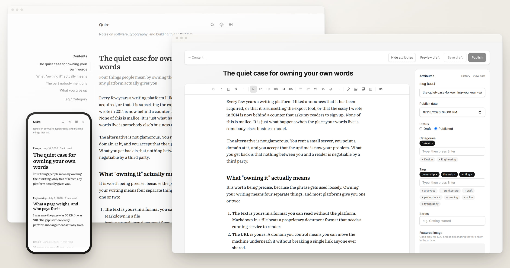

<div align="center">

# **quire**blog &nbsp;`2.0`

**An AI-operated personal blog platform. Self-hosted, no cloud lock-in.**
Write and publish from a clean multilingual admin — or hand the keys to an AI agent and let it write, publish, and even deploy for you.

<br/>


[**🌐 Live demo**](https://manhhung.me) · [**Get your own copy**](#-get-your-own-copy) · [**Let an AI run it**](#-let-an-ai-agent-write--publish-mcp) · [**How it works**](./docs/spec/02-structure.md) · [**Roadmap**](./state/ROADMAP.md) · [**License**](#-license)

<sub>The demo at **manhhung.me** is the author's personal blog — a live instance to see the *platform* in action, not a content showcase (ignore what it says, look at how it works).</sub>

<br/>



</div>

---

## ✨ What it is

An **open-source** (MIT), single-owner blog built for people who just want to **write** — and to **own the whole stack**. No SaaS, no vendor lock-in, and as of 2.0, **no infrastructure either**: one process, two SQLite files, a directory of uploads. The public site is cached in-process so it loads **insanely fast on mobile and desktop**, and it's tuned around **readable typography** — a clean reading experience first. Everything is **easy to tweak from the admin** (palettes, type, menu, fonts) with **no hardcoded values** anywhere, so you make it yours without touching code.

All the writing happens in a polished `/admin` (or over MCP). No git push to publish, no CMS to wrangle.

| Area | What you get |
|:---|:---|
| 🖋️&nbsp;**Editor** | TipTap 3 + Markdown · sticky one-row toolbar · optional typewriter caret + key feedback · drag-drop / paste image upload (JPG · PNG · WebP · AVIF · GIF · SVG) with responsive `sharp` variants · captioned figures (left/center/right, column / large / full-bleed / gallery grid) · tables · video · Spotify · Apple Music embeds · footnotes (`[^1]`) · callouts (`> [!NOTE]`) · copy-code button · 3-version time machine · offline local autosave · one-click draft preview · scheduled publishing |
| 🎨&nbsp;**Look** | a calm, editorial admin · 6 customizable light+dark palettes (+ an accent) · one tunable type system (per-role size/leading/tracking, no hardcoded sizes) · four built-in reading fonts (or upload a custom font per weight), scoped to reading text |
| 🌍&nbsp;**i18n** | Admin + site in `en · vi · de · ja · zh · ko` |
| 🔍&nbsp;**Reading** | instant search over SQLite FTS · a left sidebar rail (categories + tags, or a post's ToC) · related posts · reading time · progress bar · full-bleed images on mobile · **book reading mode** — an opt-in fullscreen two-column "book" reader (paper + grain, drop cap, shareable `#read` link) |
| 📈&nbsp;**Built-in** | cookieless analytics (views / visitors / top pages, no PII) with engagement, audience & traffic-source drill-downs · activity log · soft-delete Trash (nothing auto-purges) · in-app Help / Guide |
| 🔎&nbsp;**SEO** | sitemap · RSS · `robots.txt` · `llms.txt` · dynamic OG images · 301/302 redirects (auto-301 on slug rename) · per-post SEO title/description · cover image · real last-modified date — all toggleable |
| 📚&nbsp;**Series** | group posts into an ordered series · a series box on each part · `/series/[slug]` listing · admin **Series manager** |
| 💾&nbsp;**Backups** | one-click download of the whole install (both databases + every upload) · plus an off-box cron script — [`docs/backups.md`](./docs/backups.md) |
| 📥&nbsp;**Import** | one-click **WordPress import** from the admin — upload your WXR export, posts + pages land as Markdown |
| 🤖&nbsp;**MCP** | a remote endpoint that lets an AI agent write & manage the blog with the same rules as the admin |
| 📬&nbsp;**Newsletter** | own-SMTP sign-up (double opt-in) · unsubscribe · subscriber admin · broadcast new posts on publish · comment-reply notifications — Nodemailer, no lock-in |
| 📱&nbsp;**PWA** | installable, launches standalone |
| 🔐&nbsp;**Auth** | your own username + password (argon2id) · **TOTP required** · 10 single-use recovery codes · host-scoped `__Host-` session cookie · no third-party identity provider in the login path |
| 🚀&nbsp;**Deploy** | **one compiled binary** behind any reverse proxy. No database server, no container runtime, no cloud account |

> Built on **Bun** + **Hono**, content in **SQLite**, binaries on the **local filesystem**. The admin is a React 19 SPA; the public site ships **no framework at all** — server-rendered HTML plus a few small islands.

**Who it's for** — one person who wants a fast, good-looking, **fully self-owned** blog on their own server, and likes the idea of letting an AI agent help run it.
**Not for** — multi-author teams needing roles and editorial workflows. Quire is single-owner by design.

---

## 🚀 Get your own copy

```bash
git clone https://github.com/joiha-steven/Quire.git && cd Quire
bun install
bun run build                       # -> dist/quire, a single executable
DATA_DIR=./data SITE_URL=https://example.com ./dist/quire
```

Then point a reverse proxy with TLS at the port (default `3000`) and create your account:

```bash
bun run user create --username <name> --email <address>   # prints the TOTP secret + recovery codes, once
```

That is the whole install. There is no database to provision, no migration step to run
(the schema is applied at boot, inside a transaction), and no third-party account to
create. Full walkthrough — systemd unit, nginx, cache headers, backups, upgrades — in
**[`docs/self-host.md`](./docs/self-host.md)**.

<details>
<summary><b>🤖 &nbsp;Hand it to an AI agent</b> &nbsp;— Claude, OpenAI Codex, …</summary>

<br/>

Give an agent **SSH to your server** (and GitHub access), then ask it to deploy: clone the repo, build the binary, write the systemd unit and the nginx vhost, create your account, and return the live URL. There is no OAuth client to register and no managed service to sign up for, so it can genuinely do the whole thing end to end.

</details>

> [!TIP]
> Large uploads have **no size cap** on a self-host — the browser posts straight to the server. Put **Cloudflare (or any CDN)** in front for global edge caching + TLS; the app sends its own `cache-control`, so let the CDN honour it rather than forcing a TTL.

---

## 🤖 Let an AI agent write & publish (MCP)

Quire ships a remote **MCP** server, so a second AI agent can run your blog — drafting, editing, tagging, and **publishing straight to the live site**. No git, no deploy: content goes through the same data layer, and the same slug / revision / soft-delete rules, that the admin uses.

1. **Turn it on** — *Admin → Settings → Advanced → MCP*, generate a named token (shown **once**, hashed at rest, expires in 180 days).
2. **Connect your agent** to `https://<your-domain>/api/mcp` with `Authorization: Bearer <token>` (OAuth connectors are supported too).
3. **Prompt it**, e.g.:

```text
Using the Quire MCP server, write a 600-word post titled
"What I learned shipping a blog with an AI agent", give it the tags
"ai" and "writing", set a friendly excerpt, and publish it.
```

The post is live in seconds. Sensitive settings are blocked over MCP, and you stay the sole authority — revoke any token from the admin and it's gone.

---

## 🔑 Environment variables

Everything else is configured **in the admin**, not in the environment.

| Variable | Required | What it is |
|---|:---:|---|
| `DATA_DIR` | ✅ | Directory holding `quire.db` + `analytics.db`. Defaults to `./data` |
| `SITE_URL` | ✅ | Canonical public URL — feeds, OG images, emails. Empty means "derive per request", which is wrong behind a proxy |
| `AUTH_SECRET` | ✅ | Signs sessions, preview links and the analytics visitor hash. Any long random string |
| `STORAGE_LOCAL_DIR` | ◻️ | Where uploads live (`media/`, `files/`), served at `/uploads`. Defaults to `./uploads` |
| `PORT` | ◻️ | Defaults to `3000` |
| `CRON_SECRET` | ◻️ | Protects `/api/cron` (scheduled publishing sweep, variant sweep) |
| `MCP_OAUTH_SECRET` | ◻️ | Signs MCP OAuth codes; falls back to `AUTH_SECRET` |
| `ANALYTICS_TZ` | ◻️ | IANA zone the analytics day boundary uses. Defaults to UTC |

SMTP, Turnstile and Cloudflare credentials are entered in **Admin → Settings → Integrations** and stored server-side. Your content lives in `DATA_DIR` + the uploads directory, never in git.

---

## 🧑‍💻 Run locally (dev)

```bash
git clone https://github.com/joiha-steven/Quire.git && cd Quire
bun install
bun run dev                         # http://localhost:3000
bun run user create --username me --email me@example.com   # then sign in at /login
```

`bun run check:all` must pass before any change is done — typecheck, the static guards, and
the test suite; offline, no credentials, no services. Contributing rules are in
[`CLAUDE.md`](./CLAUDE.md).

---

## 🗂️ What's in this repository

| Path | |
|---|---|
| `src/` | The live implementation: Bun + Hono + SQLite |
| `docs/` | How it works, and why. [`docs/spec/`](./docs/spec/README.md) is the build plan, [`docs/decisions/`](./docs/decisions/README.md) the decision record |
| `state/` | Where things stand now: roadmap, tasks, worklog, audits |
| `golden/` | The rendering contract — fixtures plus the frozen tree's output for each |
| `v1/` | **Quire 1.5.0**, the Next.js + PostgreSQL implementation this replaced on 2026-07-28. Frozen, security patches only |
| `attic/` | Plans that were abandoned before anything shipped. Kept so nobody proposes them twice |

---

## 🗺️ Roadmap

See [`state/ROADMAP.md`](./state/ROADMAP.md).

---

## 📄 License

Two separate layers — keep them distinct:

- **Code (this repo) — [MIT](./LICENSE).** Free and open source: use, modify, redistribute, or sell it for any purpose, **no obligation to credit** (MIT only asks the license text travels with copies of the source). Fork it and run your own blog.
- **Content — © all rights reserved.** The writing published *with* Quire (articles, images on an operator's site, e.g. manhhung.me) belongs to its author, is **not** covered by MIT, does not live in this repo, and may not be reused without permission.

> In short: the **software** is open for anyone; the **author's writing** is not.
